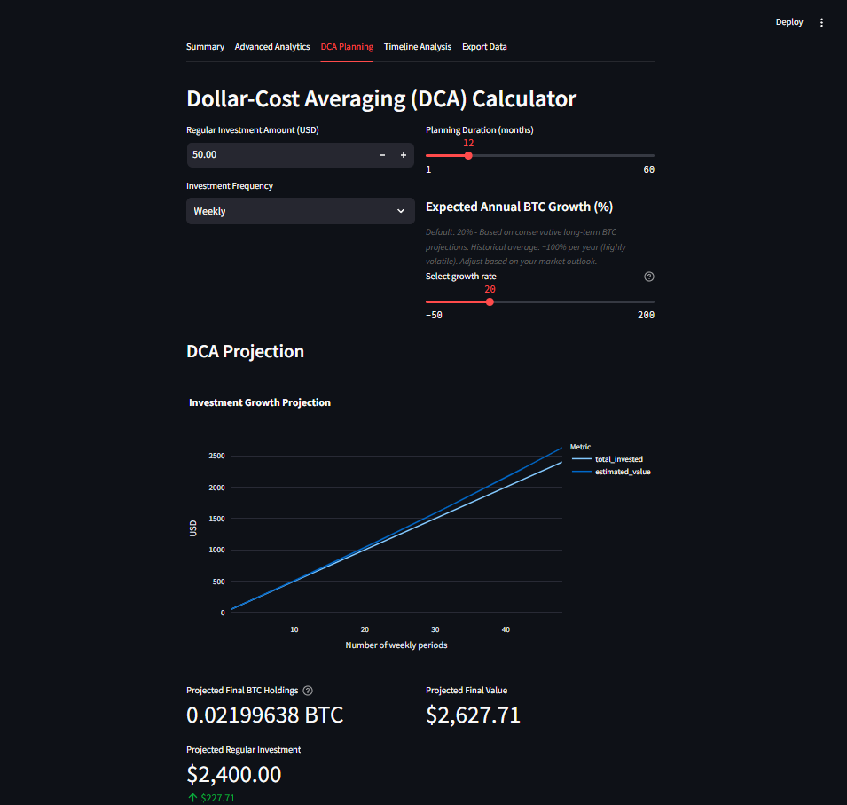

# Bitcoin Savings & Profit Tracker

This application helps you track your Bitcoin purchases, analyze your overall investment, and view timeline analytics. It supports Persian calendar calendar dates and provides advanced analytics, DCA planning, and data export features.

## Table of Contents

1. [Installation](#installation)
2. [Running the App](#running-the-app)
3. [Features](#features)
   - [Transaction Summary](#transaction-summary)
   - [Advanced Analytics](#advanced-analytics)
   - [DCA Planning](#dca-planning)
   - [Timeline Analysis](#timeline-analysis)
   - [Data Export](#data-export)
4. [Usage Guide](#usage-guide)

## Installation

1. **Clone the Repository:**

   ```bash
   git clone https://github.com/mahdilow/btc-savings-tracker.git
   cd btc-savings-tracker
   ```

2. **Create a Virtual Environment:**

   ```bash
   python -m venv venv
   ```

3. **Activate the Virtual Environment:**

   - On Windows:

     ```bash
     .\venv\Scripts\activate
     ```

   - On macOS and Linux:

     ```bash
     source venv/bin/activate
     ```

4. **Install the Required Packages:**

   ```bash
   pip install -r requirements.txt
   ```

## Running the App

To start the Streamlit app, run the following command in your terminal:

```bash
streamlit run btc_savings.py
```

This will open the app in your default web browser.

## Features

### Transaction Summary

- **CSV Import:** Upload a CSV file with your BTC transactions. The file should include `jalali_date`, `amount`, and `price` columns.
- **Manual Entry:** Add transactions manually using the Jalali calendar.
- **Transaction List:** View and manage your transactions.


### Advanced Analytics

- **Metrics:** View detailed metrics such as average buy price, total BTC, and ROI.
- **Cost Basis Analysis:** Visualize your average cost basis over time.
- **Monthly Investment Pattern:** Analyze your monthly investment trends.


### DCA Planning

- **Investment Calculator:** Plan your Dollar-Cost Averaging strategy with customizable parameters.
- **Projection Charts:** Visualize potential growth based on your inputs.



### Timeline Analysis

- **Cumulative Investment vs Portfolio Value:** Track your investment growth over time.
- **Profit and ROI Charts:** Analyze your profit and return on investment over time.


### Data Export

- **Download Options:** Export your transaction data as Excel or CSV files.
- **Data Preview:** Preview your data before exporting.


## Usage Guide

1. **Start the App:** Follow the [Running the App](#running-the-app) section to launch the application.
2. **Add Transactions:** Use the Transaction Summary tab to import or manually add your BTC transactions.
3. **Analyze Investments:** Navigate to the Advanced Analytics tab to view detailed metrics and charts.
4. **Plan Investments:** Use the DCA Planning tab to simulate different investment strategies.
5. **Track Performance:** Check the Timeline Analysis tab for a historical view of your investments.
6. **Export Data:** Use the Export Data tab to download your transaction history.

For any issues or questions, please refer to the [Issues](https://github.com/mahdilow/btc-savings-tracker/issues) section on GitHub.

---
